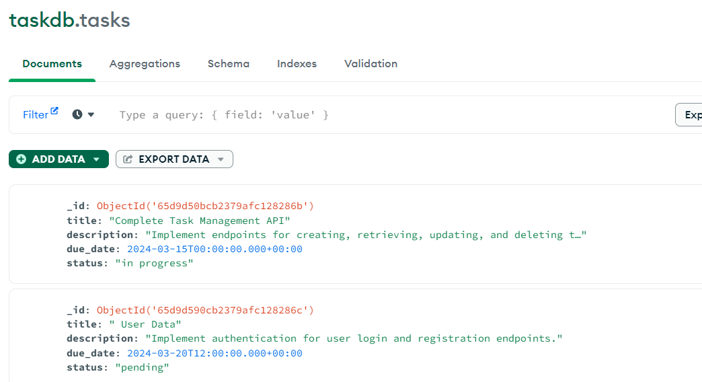
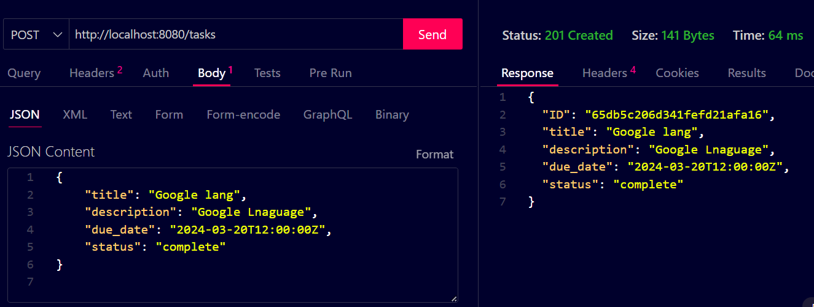
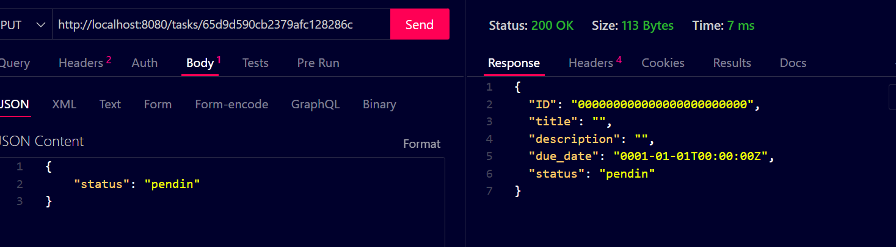
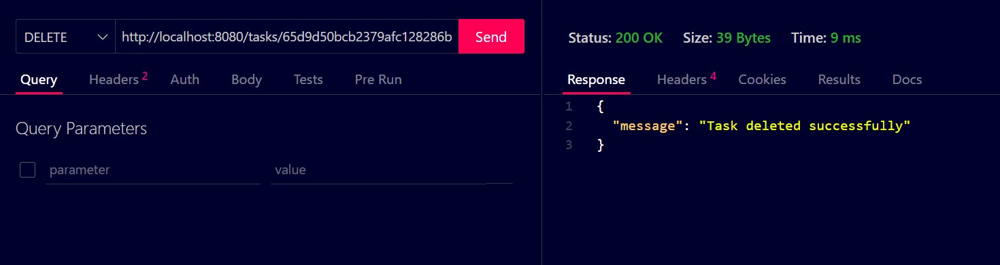

```markdown
# Task Manager API

This repository contains code for a task manager API built using Golang and MongoDB.

## Database Schema

The MongoDB database schema for storing tasks includes the following fields:

- ID: The unique identifier for each task.
- Title: The title or name of the task.
- Description: A brief description of the task.
- Due Date: The deadline or due date for the task.
- Status: The status of the task (e.g., "pending," "completed," "in progress," etc.).

```go
var client *mongo.Client

// Define a struct to represent a task
type Task struct {
	ID          primitive.ObjectID `bson:"_id,omitempty"`
	Title       string             `bson:"title" json:"title"`
	Description string             `bson:"description" json:"description"`
	DueDate     time.Time          `bson:"due_date" json:"due_date"`
	Status      string             `bson:"status" json:"status"`
}
```
<br><br>
## API Endpoints

### Create a new task

**Endpoint:** `POST /tasks`  
**Description:** Accepts a JSON payload containing the task details (title, description, due date). Generates a unique ID for the task and stores it in the database. Returns the created task with the assigned ID.

```go
func createTask(c *gin.Context) {
	//implement code here
}
```
<br><br>

### Retrieve a task

**Endpoint:** `GET /tasks/{id}`  
**Description:** Accepts a task ID as a parameter. Retrieves the corresponding task from the database. Returns the task details if found, or an appropriate error message if not found.

```go
func getTask(c *gin.Context) {
	// implement code here
}
```
<br><br>

### Update a task

**Endpoint:** `PUT /tasks/{id}`  
**Description:** Accepts a task ID as a parameter. Accepts a JSON payload containing the updated task details (title, description, due date). Updates the corresponding task in the database. Returns the updated task if successful, or an appropriate error message if not found.

```go
func updateTask(c *gin.Context) {
//implement code here
}
```
<br><br>

### Delete a task

**Endpoint:** `DELETE /tasks/{id}`  
**Description:** Accepts a task ID as a parameter. Deletes the corresponding task from the database. Returns a success message if the deletion is successful, or an appropriate error message if not found.

```go
func deleteTask(c *gin.Context) {
	//implement code here
}
```
<br><br>

### List all tasks

**Endpoint:** `GET /tasks`  
**Description:** Retrieves all tasks from the database. Returns a list of tasks, including their details (title, description, due date).

```go
func listTasks(c *gin.Context) {
	// implement code here
}
```
<br><br>
## Main Function

The main function in the project is responsible for setting up the MongoDB client, defining API endpoints, and starting the HTTP server.

```go
func main() {
    // Set up MongoDB client
    var err error
    client, err = mongo.NewClient(options.Client().ApplyURI("mongodb://localhost:27017"))
    if err != nil {
        log.Fatal(err)
    }
    err = client.Connect(context.Background())
    if err != nil {
        log.Fatal(err)
    }

    // Create a new Gin router
    router := gin.Default()

    // Define API endpoints
    router.POST("/tasks", createTask)
    router.GET("/tasks/:id", getTask)
    router.PUT("/tasks/:id", updateTask)
    router.DELETE("/tasks/:id", deleteTask)
    router.GET("/tasks", listTasks)

    // Start the HTTP server on port 8080
    router.Run(":8080")
}
```

The main function initializes the MongoDB client, sets up the Gin router, defines API endpoints for creating, retrieving, updating, and deleting tasks, and starts the HTTP server on port 8080.

## Getting Started

To run the API locally, follow these steps:

1. Make sure you have MongoDB installed and running on your machine.
2. Clone this repository.
3. Install dependencies using `go mod tidy`.
4. Run the application using `go run main.go`.

